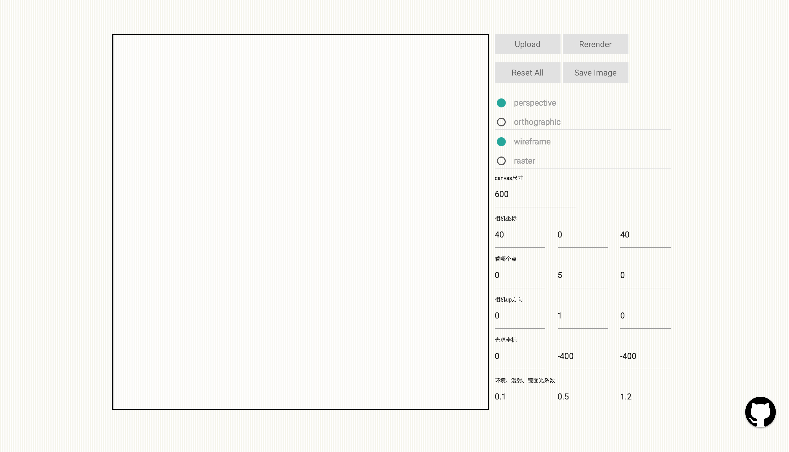
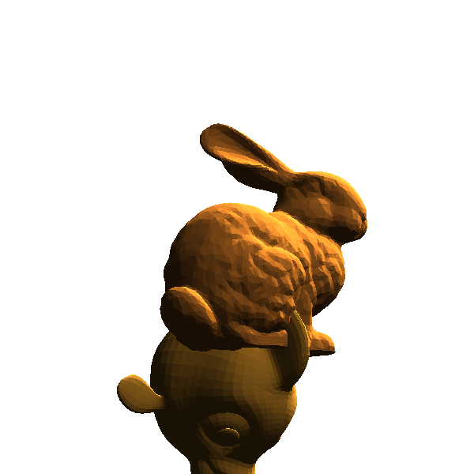

## 渲染器大作业

软硕163 周伯威

2016213588

### 1. 已实现功能

1. 三角网格模型加载

   **（1）实现从obj格式文件读入三角网格模型**

2. 相机模型

   （1）实现透视投影

   （2）实现场景中的漫游（旋转、平移、缩放）

   附加项

   （3）实现正交投影

3. 渲染

   （1）场景中至少包含两个三角网格模型

   （2）实现Phong光照模型

### 2. 使用说明

* 打开index.html

  

* 点击upload按钮，选择obj文件进行上传，推荐上传models文件夹下的bunny.obj与Fish.obj(因为参数已经设置好)

  

* 点击orthographic按钮，并点击rerender，切换至平行投影

  

* 点击raster按钮，并点击rerender，切换至光栅渲染

  

* 其他参数在下面相应输入框内可设置，设置之后需点击rerender按钮，例如: 调整分辨率变成2000x2000以消除锯齿:

  

  ​